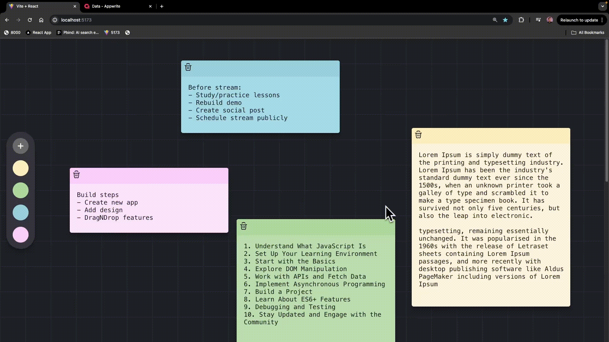

# NoteFlow

A minimal, drag-and-drop sticky notes app. Create notes, move them anywhere on the board, recolor them, and everything autosaves in the background.

**Live:** [noteflowio.vercel.app](https://noteflowio.vercel.app)



## Features

- **Draggable notes** — position each note anywhere on the board; layout is saved automatically
- **Autosave** — note content and position sync to the backend a couple seconds after you stop typing/dragging
- **Color picker** — recolor any note from a preset palette
- **Serverless backend** — notes are stored in Upstash Redis via Vercel serverless functions, no server to manage

## Tech Stack

| Layer     | Tech                                       |
| --------- | ------------------------------------------ |
| Frontend  | React 19, React Router, Vite               |
| API       | Vercel Serverless Functions (Node)         |
| Data      | Upstash Redis                              |
| Hosting   | Vercel                                     |

## Getting Started

### Prerequisites

- Node.js 20+
- A [Vercel](https://vercel.com) account
- The [Vercel CLI](https://vercel.com/docs/cli) — `npm install -g vercel`

### 1. Clone the repository

```sh
git clone https://github.com/hasnaintypes/noteflow-app.git
cd noteflow-app
```

### 2. Install dependencies

```sh
npm install
```

### 3. Link the project and provision Redis

```sh
vercel link
vercel integration add upstash/upstash-kv
```

This provisions a free Upstash Redis database and connects it to the project. Then pull the generated environment variables:

```sh
vercel env pull .env.local
```

`.env.local` should end up with `KV_REST_API_URL`, `KV_REST_API_TOKEN`, and `KV_REST_API_READ_ONLY_TOKEN` — see `.env.example` for reference.

### 4. Run it locally

The notes API runs as Vercel serverless functions, so use `vercel dev` (not plain `vite`) to get the full app working locally:

```sh
vercel dev
```

The app will be available at `http://localhost:3000` (or the port `vercel dev` reports).

## Deployment

```sh
vercel        # preview deployment
vercel --prod # production deployment
```

## Project Structure

```
api/
  notes/
    index.js     # GET (list) / POST (create)
    [id].js      # GET / PATCH (update) / DELETE
src/
  components/    # UI components (notes board, controls, buttons)
  context/       # Notes state (React context)
  icons/         # Inline SVG icon components
  lib/           # Client-side API wrapper
  pages/         # Route-level pages
```

## Roadmap

- Markdown support for note content
- Real-time multi-user collaboration
- Search and filter across notes
- Offline mode with local persistence

## Contributing

Contributions are welcome. Fork the repo, create a branch, make your changes, and open a pull request.
